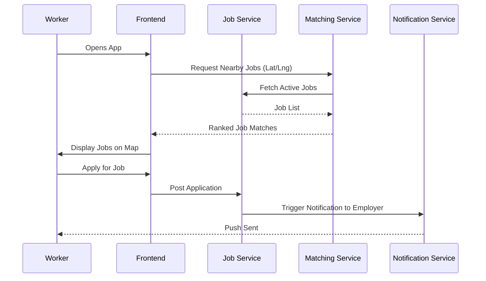

# Application Flow – WorkNow

This document outlines the end-to-end user journeys for both **Employers** and **Workers** on the WorkNow platform.

## 👥 User Roles

1. **Employer:** Posts jobs, reviews applications, and pays for completed work.
2. **Worker:** Searches for jobs, applies, completes tasks, and earns money.

---

## 🛠 Core Workflows

### 1. Registration & Verification
1. **Signup:** User registers via the `Auth Service`.
2. **Profile Creation:** User completes their profile in the `User Service`.
3. **KYC Upload:** Workers upload identity documents (Aadhar, Student ID, etc.).
4. **Admin Review:** Documents are reviewed; status updates from `PENDING` to `VERIFIED`.

### 2. Job Lifecycle
1. **Posting:** Employer posts a gig with location, budget, and required skills.
2. **Matching:** The `Matching Service` identifies nearby qualified workers.
3. **Application:** Workers see the job on their map and apply.
4. **Hiring:** Employer reviews profiles and hires a worker.
5. **Completion:** Worker completes the task; Employer marks job as done.

### 3. Payment & Wallet Flow
1. **Top-up:** Users add funds to their wallet via `Payment Service` (Razorpay).
2. **Escrow:** (Conceptual) Funds are secured when a worker is hired.
3. **Payout:** Upon completion, funds are transferred to the worker's `walletBalance`.
4. **Transaction History:** All movements are logged in the `Transaction` table.

---

## 🔄 Service Interaction Diagram

---

## 📱 Mobile Experience
- **Location Awareness:** Uses the browser/mobile GPS to find gigs in real-time.
- **Push Notifications:** Instant alerts for new matches or payment receipts.
- **Mobile Wallet:** Easy top-ups and balance checks on the go.

---
*Last updated: April 2026*
