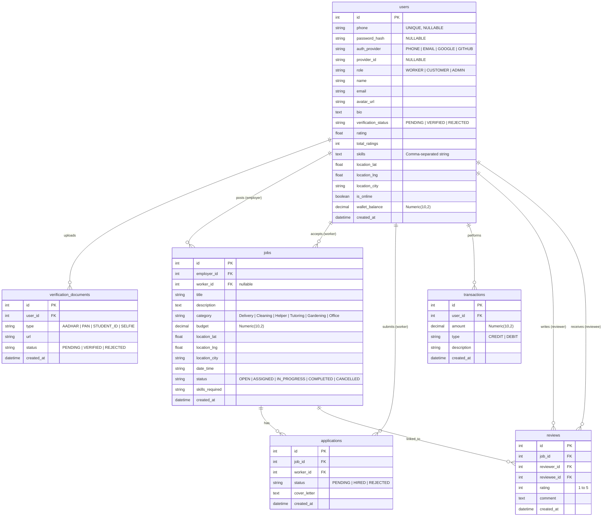

# Entity-Relationship (ER) Diagram - WorkNow

This document defines the schema structure and relationships for the WorkNow MySQL database.

## Database Schema Model (Mermaid Diagram)

---

## Table Descriptions

### 1. `users` Table
Stores authentication details and profiles of both employers (Customers) and gig workers (Students).
- `role`: Distinguishes user access control between employer dashboard and student work feed.
- `verification_status`: Determines if a worker has been vetted by an admin to start accepting gigs.
- `wallet_balance`: Used to book escrows for jobs and receive job payouts.

### 2. `verification_documents` Table
Holds the verification documents uploaded by students. 
- Relationships: Linked to `users.id` (Many-to-One).

### 3. `jobs` Table
Stores posted gig requests.
- `employer_id`: Identifies the creator of the gig.
- `worker_id`: Identifies the hired student worker (null when open).
- `status`: Drives the task lifecycle progression (OPEN → ASSIGNED → IN_PROGRESS → COMPLETED).

### 4. `applications` Table
Connects student applications to jobs they are interested in.
- Relationships: Linked to `jobs.id` and `users.id`.

### 5. `transactions` Table
Audits movements of wallet funds (top-ups, escrow holds, job payouts, bank withdrawals).
- Relationships: Linked to `users.id`.

### 6. `reviews` Table
Stores peer-to-peer feedback left after gig completion.
- Relationships: Linked to `jobs.id`, reviewer `users.id`, and reviewee `users.id`.
